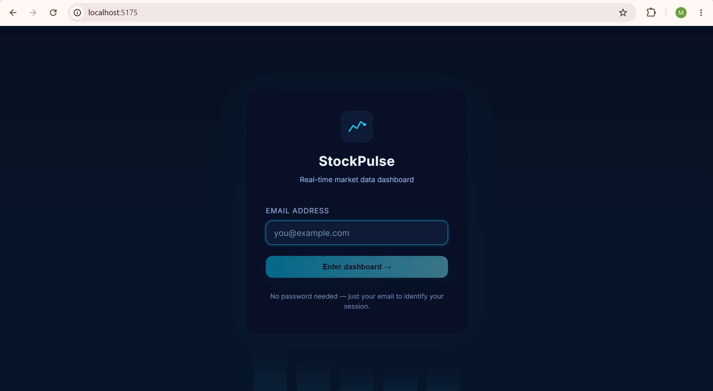
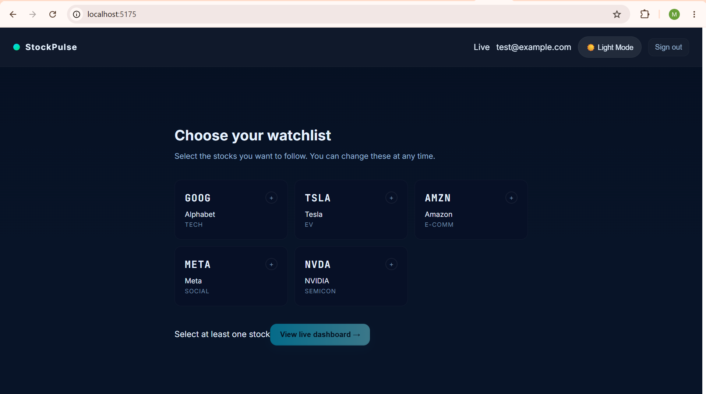
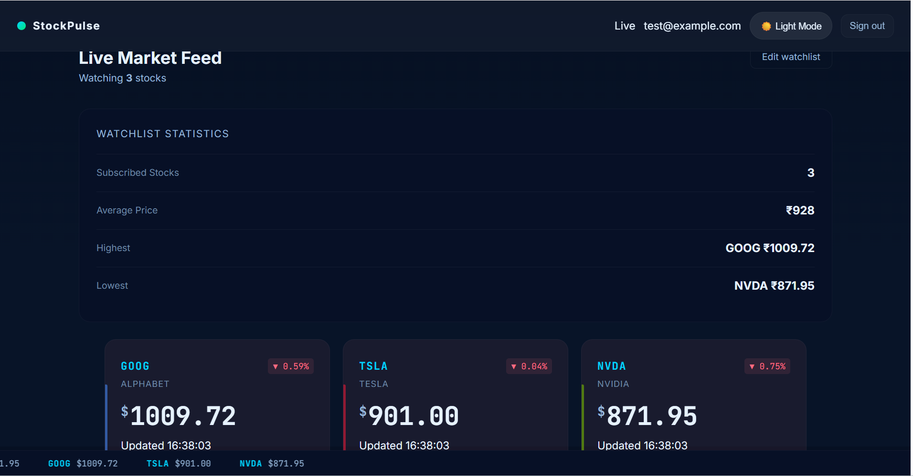

# StockPulse — Real-Time Stock Broker Client Dashboard

StockPulse is a real-time stock dashboard built with React, Node.js, Express, and Socket.IO. It allows users to log in with an email, subscribe to supported stock tickers, and view live price updates without refreshing the page.

## Overview

This project was built to demonstrate:
- real-time client-server communication,
- user-specific stock subscriptions,
- live UI updates,
- and a clean dashboard experience for multiple users.

Stock prices are simulated on the server and updated every second so the app behaves like a live market dashboard without relying on external APIs.

## Features

- Email-based login.
- Subscribe and unsubscribe to supported stock tickers.
- Live price updates without page refresh.
- Multiple users supported at the same time.
- Separate watchlists for each user.
- Server-side stock price simulation.
- Responsive dashboard UI.
- Local storage persistence for session data.
- Lightweight sparkline charts for price trends.
- Dark and light mode support.

## Supported Stocks

The dashboard currently supports the following tickers:
- GOOG
- TSLA
- AMZN
- META
- NVDA

## Tech Stack

### Frontend
- React
- Vite
- Socket.IO Client
- CSS

### Backend
- Node.js
- Express.js
- Socket.IO

## How It Works

1. A user logs in using an email address.
2. The user subscribes to one or more supported stock tickers.
3. The server generates simulated price changes every second.
4. Updated prices are broadcast to connected clients through Socket.IO.
5. Each user sees only the stocks they subscribed to.

## Architecture

```text
React Client
      │
      │ Socket.IO
      ▼
Node.js + Express Server
      │
      ▼
Stock Price Simulator
(Random updates every second)
```

## Design Decisions

### Real-Time Updates
Socket.IO was used because it provides a simple way to push updates to the UI without polling or page refreshes.

### Server-Side Simulation
Stock prices are generated on the backend so the dashboard behaves like a live system while staying self-contained for evaluation.

### User Isolation
Each user maintains an independent subscription list, so updates for one session do not affect another.

### Simplicity Over Complexity
The goal was to keep the implementation lightweight and focused on the assignment requirements while still making the dashboard feel complete.

## Project Structure

```text
stock-dashboard/
├── client/
│   ├── src/
│   └── package.json
├── server/
│   ├── server.js
│   └── package.json
└── README.md
```

## Setup

### Clone the repository

```bash
git clone <repository-url>
cd stock-dashboard
```

### Install backend dependencies

```bash
cd server
npm install
```

### Install frontend dependencies

```bash
cd client
npm install
```

## Run the application

### Start the backend

```bash
cd server
npm start
```

Backend runs at:
```text
http://localhost:4000
```

### Start the frontend

```bash
cd client
npm run dev
```

Frontend runs at:
```text
http://localhost:5173
```

## Validation

The app was built to satisfy the following requirements:
- email login,
- support for five tickers,
- subscription-based dashboard,
- live updates without refresh,
- multiple users,
- independent watchlists,
- asynchronous update flow.

## Screenshots

### Login Page

User authentication using email login.



### Stock Selection

Select supported stocks to subscribe.



### Live Dashboard

- Real-time stock prices
- Watchlist statistics
- Sparkline charts
- Theme controls
- Live market feed



## Notes

- No external stock market API is used.
- Prices are simulated for demonstration purposes.
- The project is designed to show real-time frontend and backend integration in a compact implementation.

## Future Improvements

With more time, I would add:
- real authentication,
- persistent user sessions,
- historical price storage,
- websocket scaling for more users,
- and integration with a real market data provider.
